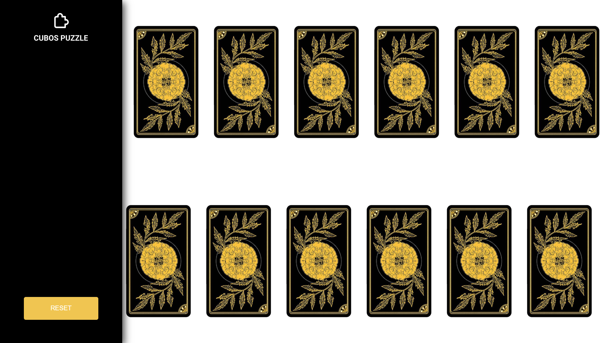
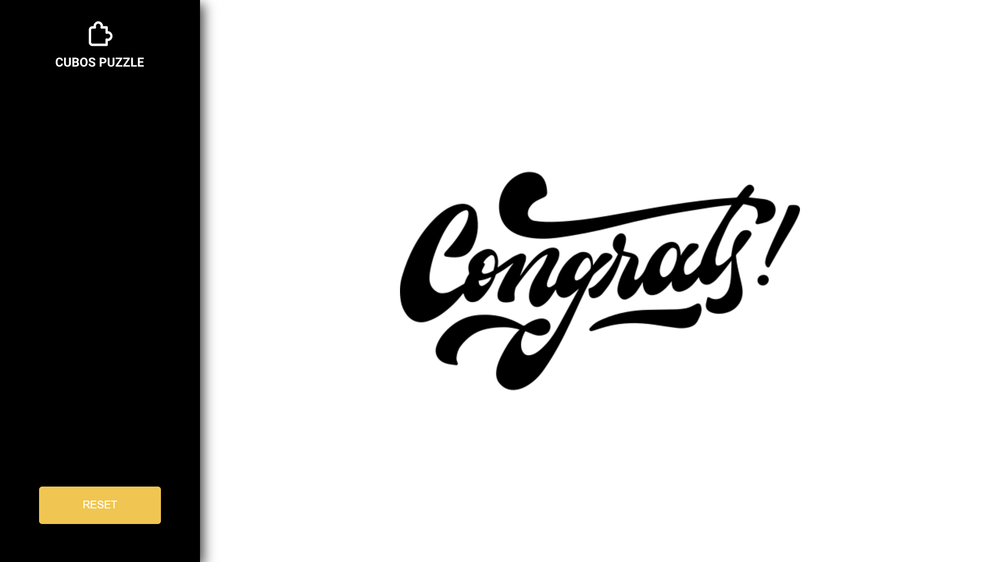

<h1 align="center"> Jogo da memória </h1>

Esse projeto se trata de um jogo da memória, onde teremos alguma cartas e precisamos clicar nelas para virá-las e tentar fazer o 'match' com alguma carta.

  <a href="#-tecnologias">Tecnologias</a>&nbsp;&nbsp;&nbsp;|&nbsp;&nbsp;&nbsp;
  <a href="#-projeto">Projeto</a>&nbsp;&nbsp;&nbsp;|&nbsp;&nbsp;&nbsp;
  <a href="#-layout">Layout</a>&nbsp;&nbsp;&nbsp;

 

  
  

## 🚀 Tecnologias

Esse projeto foi desenvolvido com as seguintes tecnologias:

- ReactJS
- HTML e CSS
- JavaScript
- Git e Github

## 💻 Projeto

Esse projeto se trata de um jogo da memória, onde teremos alguma cartas e precisamos clicar nelas para virá-las e tentar fazer o 'match' com alguma carta. Nesse jogo é utilizado o hook useState do react para fazer as cartas virarem e se manterem viradas.

## 🔖 Layout

Você pode visualizar o layout do projeto através [DESSE LINK](https://www.figma.com/file/VPpPBcwhCiAiTKHd07nwwL/figma?t=vQQABvRCWKlGp2SZ-1). É necessário ter conta no [Figma](https://figma.com) para acessá-lo.